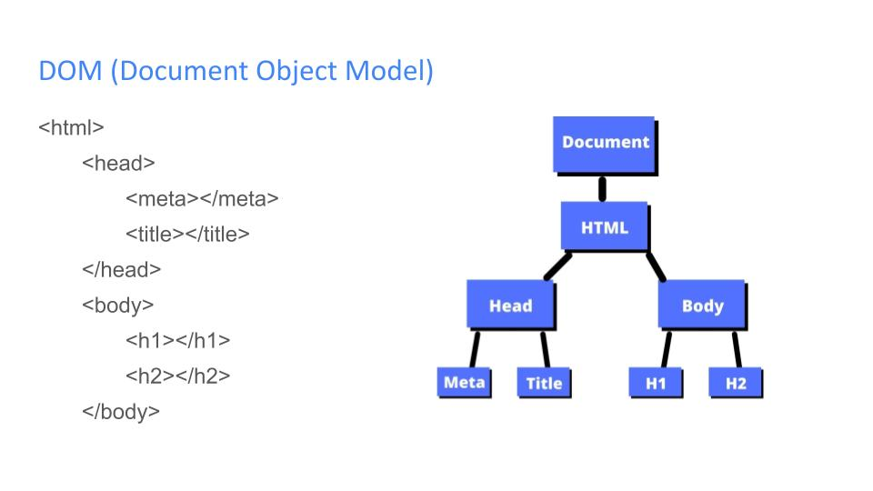
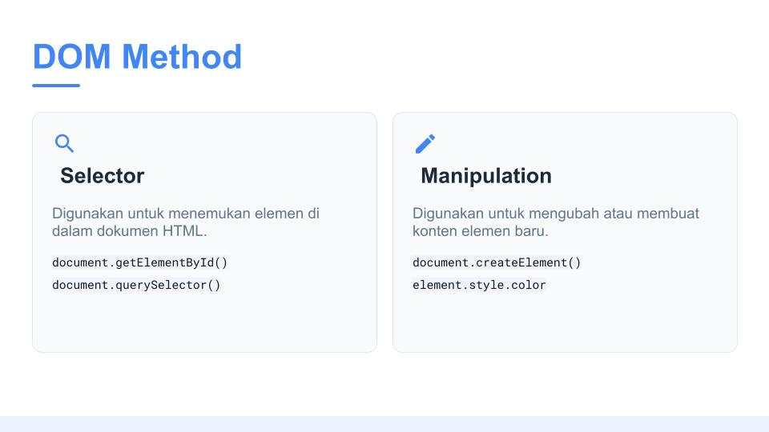
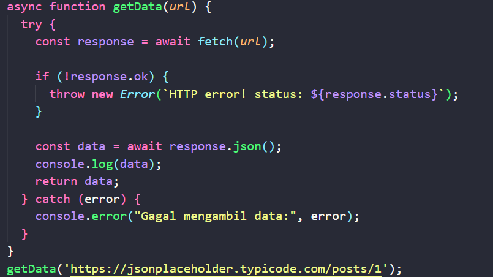
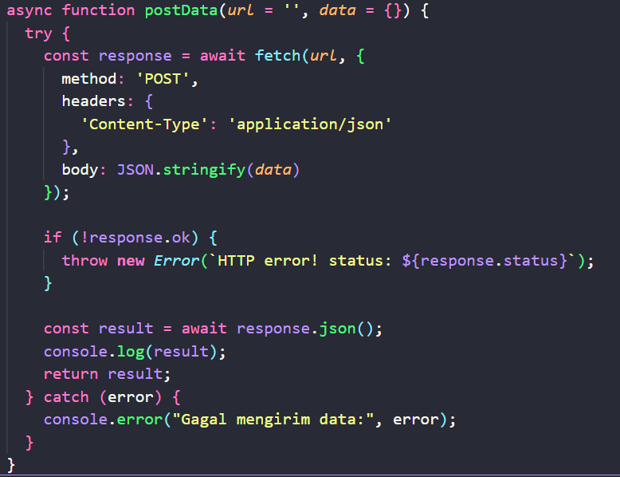

# Weekly-4 Movie Catalogue Project
Pada dasarnya Javascript tidak bisa bekerja di halaman web (HTML) secara langsung, untuk itu dibutuhkan Document Object Model(DOM) yang menjadi jembatan. DOM mengubah struktur dokumen HTML menjadi objek yang memungkinkan Javascript mengakses, mengubah, menambah atau menghapus elemen, konten dan gaya halaman.

# DOM Method
DOM (Document Object Model) Method adalah aksi atau tindakan yang bisa kamu lakukan pada elemen HTML melalui JavaScript dimana kita dapat memilih dan memanipulasi elemen, konten dan style.

1. Memilih Elemen (Selecting)
method yang digunakan untuk "menangkap" elemen HTML.

- getElementById('id'): Mengambil satu elemen spesifik berdasarkan ID.

- querySelector('.class / #id'): Lebih fleksibel, bisa mengambil elemen berdasarkan selector CSS (class, id, atau tag).

- querySelectorAll('selector'): Mengambil semua elemen yang cocok dan menyimpannya dalam daftar (NodeList).

2. Manipulasi Konten & Atribut
method yang digunakan untuk mengubah isi HTML.

- textContent: Mengubah teks di dalam elemen (hanya teks murni).

- innerHTML: Mengubah isi elemen, termasuk tag HTML di dalamnya.

- setAttribute('nama', 'nilai'): Menambahkan atau mengubah atribut (seperti src pada gambar atau href pada link).

- style.property: Mengubah gaya CSS secara langsung (misal: element.style.color = 'red').

3. Menambah & Menghapus Elemen
method yang membuat halaman web menjadi dinamis dengan menambah elemen baru saat runtime.

- createElement('tag'): Membuat elemen HTML baru di memori.

- appendChild(node): Memasukkan elemen yang baru dibuat ke dalam elemen lain sebagai "anak" terakhir.

- remove(): Menghapus elemen tersebut dari halaman.

4. Event Handling
Method ini digunakan agar website bisa berinteraksi dengan pengguna.

- addEventListener('event', function): Menunggu aksi tertentu (seperti click, submit, atau keyup) kemudian menjalankan fungsi tertentu sebagai responnya.

# Window vs Document
Window adalah objek global di browser, artinya semua yang terjadi di browser diatur diwindow. 
Property/method window:
- window.innerHeight: Mengetahui tinggi jendela browser.

- window.alert(): Menampilkan pesan peringatan.

- window.location: Mengatur atau mengambil alamat URL.

- window.localStorage: Menyimpan data di browser secara lokal.

Document merupakan bagian dari window, yang mempresentasikan struktur HTML. Dengan document kita dapat memanipulasi elemen HTML, berikut properti/method:
- document.getElementById(): Mencari elemen HTML.

- document.body: Mengakses bagian body halaman.

- document.createElement(): Membuat elemen baru.

- document.title: Mengubah judul yang muncul di tab browser.

# Event Propagation Behaviour
Tiga Fase Utama:
1. Capturing Phase: Event turun dari elemen induk paling atas (window) menuju ke target elemen.
2. Target Phase: Event sampai pada elemen yang diklik/dipicu.
3. Bubbling Phase: Event naik kembali dari target elemen menuju ke atas hingga ke window.

# Fetch GET vs POST
Dalam dunia API dan pengiriman data, GET dan POST adalah dua metode (HTTP Methods) yang paling sering digunakan dalam fungsi fetch().

1. GET: Mengambil Data
Metode GET digunakan untuk meminta (mengambil) data dari server tanpa mengubah apa pun di sana.

2. POST: Mengirim Data
Metode POST digunakan untuk mengirimkan data ke server untuk membuat atau memperbarui sesuatu (seperti mendaftar akun atau mengirim pesan).

# Screenshot Movie-catalogue project

Berikut Link Tugas: [Movie-catalogue](https://vercel.com/iamhanif11s-projects/movie-catalogue-project/8kMV9NH4PS26gFypPbcWH2qAvjjr)